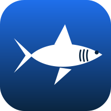

# 🦈 badge-sandbox

**A little pond for chasing GitHub profile achievements.**

---

## About

Exactly what it sounds like: a sandbox for unlocking and leveling up GitHub profile achievements. No real project lives here, it's just the water where pull requests come to get merged.

## 🏆 Achievements earned here

| Badge | Tier | What it takes |
| :--- | :--- | :--- |
| 🦈 Pull Shark | **x2 (Bronze)** | merge 16 pull requests |
| 🎯 Quickdraw | unlocked | close an issue or PR within 5 minutes of opening it |
| 🎲 YOLO | unlocked | merge a pull request with no review |

## 🦈 Pull Shark tiers

| Tier | Merged PRs |
| :--- | ---: |
| Pull Shark | 2 |
| x2 Bronze | 16 |
| x3 Silver | 128 |
| x4 Gold | 1,024 |

Currently sitting on **128 merged PRs**, so Silver is banked and just waiting on GitHub's recompute to display.

## Notes

- Achievements are recomputed on GitHub's own schedule, sometimes within minutes, sometimes over several days.
- They are recorded on your account, but count based ones like Pull Shark are tallied from your merged PRs, so this repo stays put rather than getting deleted.

---

swimming toward Gold 🥇

